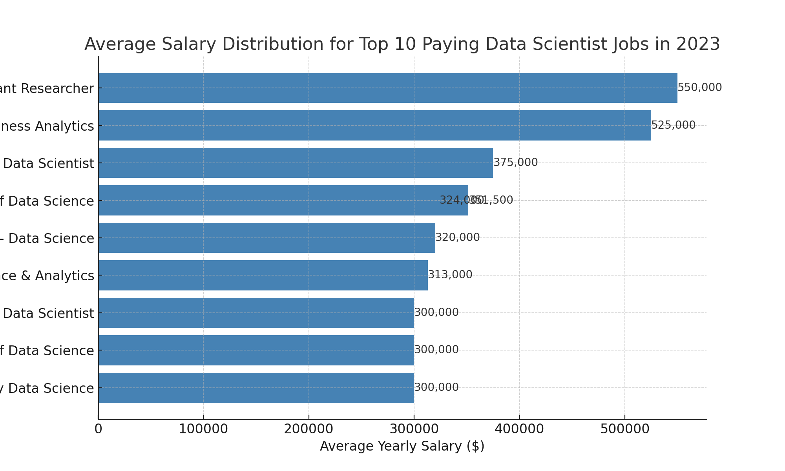
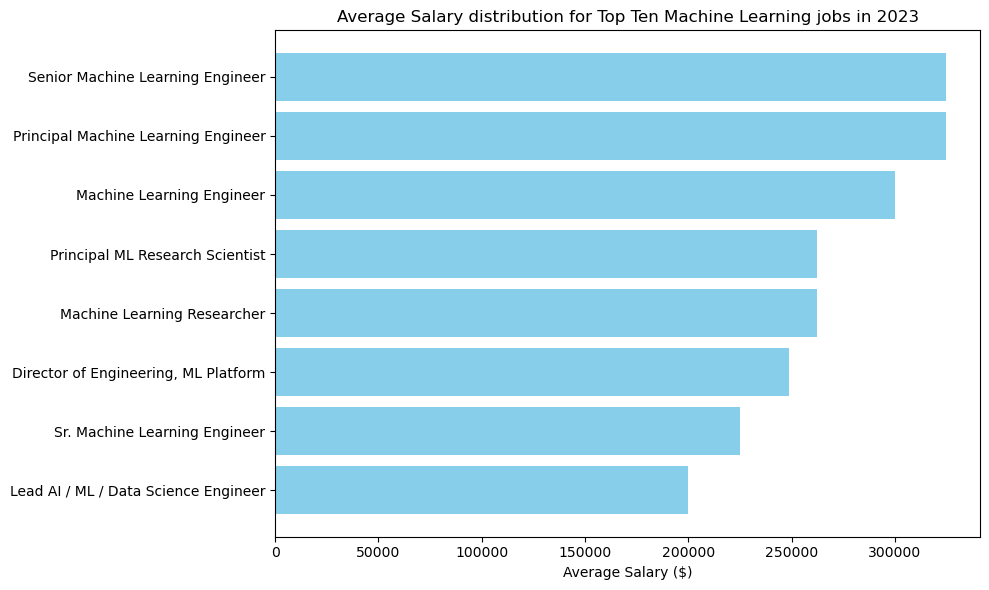
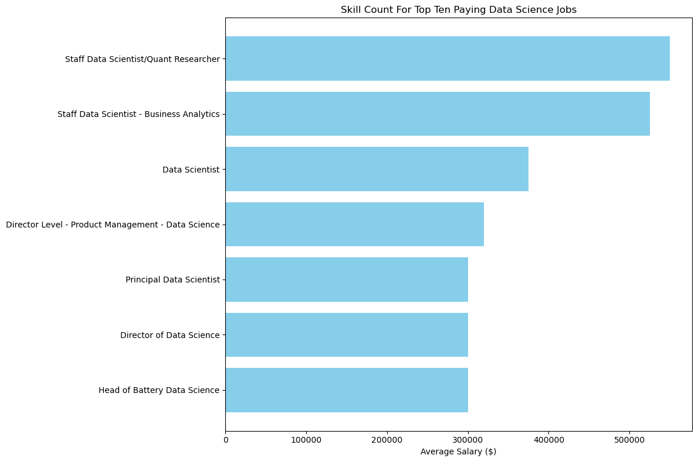
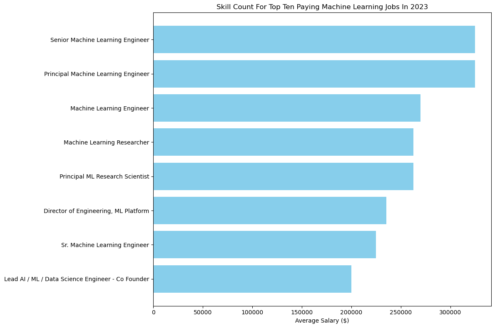

# Introduction

**_Exploring the Data Analytics, Data Science, and Machine Learning Engineering Job Market._**

This project provides an in-depth analysis of the job market, focusing on:

💰 Top-Paying Roles

🔥 In-Demand Skills

📈 Where High Demand Meets High Salary

Explore the SQL queries and insights in the [project_sql folder](/SQL_project/)

# Background

Driven by a quest to effectively navigate the job market, this project is crafted to identify top-paying and in-demand skills across data analytics, data science, and machine learning engineering.

As a current Data Analyst with a clear roadmap to transition into Data Science and ultimately become a Machine Learning Engineer, this project holds significant personal relevance. My goal is to uncover the most valuable and strategic skills to advance my career and break into the field of machine learning.

The data for this analysis comes from [SQL Course For Data Analytics](https://lukebarousse.com/sql), offering detailed insights into job titles, salaries, locations, and essential skills.

Explore the project to discover top-paying roles, in-demand skills, and optimal career pathways tailored to my journey from data analyst to machine learning engineer.

# The tools i used

**For my deep dive into the data analyst, data scientist and machine learning job market, I utilized several key tools:**

- **SQL:** The backbone of my analysis, enabling detailed queries and the extraction of critical insights from the data.
- **PostgreSQL:** The chosen database management system, well-suited for managing and processing job posting data.
- **Visual Studio Code:** My primary environment for database management and executing SQL queries efficiently.
- **Git & GitHub:** Vital for version control and sharing SQL scripts and analysis, facilitating collaboration and effective project tracking.

Here’s a refined version of the questions addressed in your SQL queries:

---

### Key Questions Explored Through SQL Queries:

1. **What are the top-paying roles in data analytics, data science, and machine learning?**
2. **Which skills are essential for securing these top-paying positions?**
3. **What skills are currently in the highest demand across these fields?**
4. **Which skills are linked to higher salaries?**
5. **What are the most strategic skills to acquire for career advancement in data analytics, data science, and machine learning?**

# The Analysis

Each query for this project aimed at investigating specific aspects of the data analyst job market. Here’s how I approached each question:

### 1. Top Paying Data Analyst Jobs

To identify the highest-paying roles, I filtered data analyst positions by average yearly salary and location, focusing on remote jobs. This query highlights the high paying opportunities in the field.

```sql
SELECT
	job_id,
	job_title,
	job_location,
	job_schedule_type,
	salary_year_avg,
	job_posted_date,
    name AS company_name
FROM
    job_postings_fact
LEFT JOIN company_dim ON job_postings_fact.company_id = company_dim.company_id
WHERE
    job_title_short = 'Data Analyst' AND
    job_location = 'Anywhere' AND
    salary_year_avg IS NOT NULL
ORDER BY
    salary_year_avg DESC
LIMIT 10;
```

OBSERVATIONS:

Variation by Role: Salaries significantly vary by role, with higher-level positions like
"Director of Analytics" commanding higher salaries compared to standard data analyst roles.

Variation by Company: Prestigious companies like Meta and AT&T offer competitive salaries,
though the highest salary is surprisingly offered by Mantys for a "Data Analyst" role.

Salary Spread: There is a wide range in salaries even within similar roles, which may reflect
different levels of seniority, scope of responsibilities, or company-specific pay scales.


_Bar graph visualizing the salary for the top 10 salaries for data analysts; used python to generate this graph from my SQL query results_

### 2. Top Paying Data Scientist Jobs

To identify the highest-paying roles, I filtered data scientist positions by average yearly salary and location, focusing on remote jobs. This query highlights the high paying opportunities in the field.

```sql
SELECT
	job_id,
	job_title,
	job_location,
	job_schedule_type,
	salary_year_avg,
	job_posted_date,
    name AS company_name
FROM
    job_postings_fact
LEFT JOIN company_dim ON job_postings_fact.company_id = company_dim.company_id
WHERE
    job_title_short = 'Data Scientist' AND
    job_location = 'Anywhere' AND
    salary_year_avg IS NOT NULL
ORDER BY
    salary_year_avg DESC
LIMIT 10;
```

OBSERVATIONS:

- **Role-Specific Trends**: High-level and specialized data science roles, especially those involving quantitative research or
  business analytics, command significantly higher salaries.

- **High Earning Roles**: Staff Data Scientist positions at Selby Jennings top the salary list, emphasizing that specialized
  data science roles, particularly those involving quantitative research, are highly compensated.

- **Salary Distribution**: The salaries range from \$300,000 to \$550,000, with a mean salary of approximately \$365,850 and
  a standard deviation of \$93,799. This indicates a generally high salary level with moderate variability.

- **Company-Specific Trends**: Companies with a strong focus on technology and data, such as Mantys and Selby Jennings,
  are leading in salary offerings, emphasizing their investment in top data talent.


_Bar graph visualizing the salary for the top 10 salaries for data scientists; used python to generate this graph from my SQL query results_

### 3. Top Paying Machine Learning Engineer Jobs

To identify the highest-paying roles, I filtered Machine Learning positions by average yearly salary and location, focusing on remote jobs. This query highlights the high paying opportunities in the field.

```sql
SELECT
	job_id,
	job_title,
	job_location,
	job_schedule_type,
	salary_year_avg,
	job_posted_date,
    name AS company_name
FROM
    job_postings_fact
LEFT JOIN company_dim ON job_postings_fact.company_id = company_dim.company_id
WHERE
    job_title_short = 'Machine Learning Engineer' AND
    job_location = 'Anywhere' AND
    salary_year_avg IS NOT NULL
ORDER BY
    salary_year_avg DESC
LIMIT 10;
```

OBSERVATIONS:

- **Role-Specific Trends**: High-level machine learning roles, such as Principal Engineer and Director of Engineering,
  are prominent, indicating a demand for senior expertise in the field.

- **High Earning Roles**: Positions like Principal Machine Learning Engineer and Senior Machine Learning Engineer are among
  the highest paid, reflecting the value placed on advanced technical skills and leadership.

- **Salary Distribution**: Salaries range from \$200,000 to \$325,000, with several roles offering over \$300,000.
  This suggests a competitive salary landscape for specialized and senior roles.

- **Company-Specific Trends**: Companies like Acceler8 Talent and MongoDB are actively hiring for these high-paying roles,
  highlighting their focus on attracting top machine learning talent.


_Bar graph visualizing the salary for the top 10 salaries for data analysts; used python to generate this graph from my SQL query results_

### 4. Skills for Top Paying Data Analyst Jobs

To understand what skills are required for the top-paying jobs, I joined the job postings with the skills data, providing insights into what employers value for high-compensation roles.

```sql
WITH top_paying_jobs AS (
    SELECT
        job_id,
        job_title,
        salary_year_avg,
        name AS company_name
    FROM
        job_postings_fact
    LEFT JOIN company_dim ON job_postings_fact.company_id = company_dim.company_id
    WHERE
        job_title_short = 'Data Analyst' AND
        job_location = 'Anywhere' AND
        salary_year_avg IS NOT NULL
    ORDER BY
        salary_year_avg DESC
    LIMIT 10
)

SELECT
    top_paying_jobs.*,
    skills
FROM top_paying_jobs
INNER JOIN skills_job_dim ON top_paying_jobs.job_id = skills_job_dim.job_id
INNER JOIN skills_dim ON skills_job_dim.skill_id = skills_dim.skill_id
ORDER BY
    salary_year_avg DESC;
```

### Here's the breakdown of the most demanded skills for the top 10 highest paying data analyst jobs in 2023:

1. **High Salary Correlation**: The "Associate Director- Data Insights" role at AT&T has a high average salary of $255,829.5, indicating that senior data positions, especially those focused on insights, command significant salaries.

2. **Key Skills**:

   - **SQL**: Essential for data manipulation and database management.
   - **Python**: Dominant in data analysis and machine learning.
   - **R**: Valuable for statistical analysis and specialized modeling.
   - **Azure**: Important for cloud computing and data storage.
   - **Databricks**: In demand for big data and analytics platform expertise.

3. **Skill Combination Strategy**: Combining SQL, Python, R, Azure, and Databricks is strategic for advanced data analysis, engineering, and insights generation.

4. **Demand for Versatile Skill Sets**: A versatile mix of querying, programming, cloud, and big data skills is highly rewarded, highlighting the need for well-rounded technical abilities in high-level data roles.

These insights emphasize the importance of a multidisciplinary skill set to secure top-paying data jobs focused on insights and decision-making.


_Bar graph visualizing the count of skills for the top 10 paying jobs for data analysts; used python to generate this graph from my SQL query results_

### 5. Skills for Top Paying Data Scientist Jobs

To understand what skills are required for the top-paying jobs, I joined the job postings with the skills data, providing insights into what employers value for high-compensation roles.

```sql
WITH top_paying_jobs AS (
    SELECT
        job_id,
        job_title,
        salary_year_avg,
        name AS company_name
    FROM
        job_postings_fact
    LEFT JOIN company_dim ON job_postings_fact.company_id = company_dim.company_id
    WHERE
        job_title_short = 'Data Scientist' AND
        job_location = 'Anywhere' AND
        salary_year_avg IS NOT NULL
    ORDER BY
        salary_year_avg DESC
    LIMIT 10
)

SELECT
    top_paying_jobs.*,
    skills
FROM top_paying_jobs
INNER JOIN skills_job_dim ON top_paying_jobs.job_id = skills_job_dim.job_id
INNER JOIN skills_dim ON skills_job_dim.skill_id = skills_dim.skill_id
ORDER BY
    salary_year_avg DESC;
```

### Here's the breakdown of the most demanded skills for the top 10 highest paying data scientist jobs in 2023:

1. **Top-Paying Job Titles and Associated Skills**:

   - The highest paying jobs, such as "Staff Data Scientist/Quant Researcher" and "Staff Data Scientist -
     Business Analytics," are consistently associated with key skills like `SQL` and `Python`.

   - These skills are essential in data science roles, especially for high-level positions where advanced
     data manipulation and statistical analysis are crucial.

2. **Skill Frequency**:

   - Both `SQL` and `Python` are prominently featured across the top-paying job listings, highlighting their
     critical role in data science and analytics.

   - This consistency suggests that mastering these skills can significantly impact earning potential in
     data-related roles.

3. **Company-Specific Preferences**:

   - Different companies, like Selby Jennings and Algo Capital Group, prioritize similar technical skills
     (`SQL` and `Python`) for their high-paying positions, indicating industry-wide recognition of these
     competencies as valuable.

4. **Economic Value of Skills**:
   - The data reinforces the economic value of developing advanced proficiency in `SQL` and `Python`, as
     these skills not only align with job demand but also command some of the highest salaries in the market.

This analysis underscores the importance of focusing on these core technical skills if you're aiming to
secure top-paying roles in the data analytics and data science fields.



_Bar graph visualizing the count of skills for the top 10 paying jobs for data analysts; used python to generate this graph from my SQL query results_

### 6. Skills for Top Paying Machine Learning Jobs

To understand what skills are required for the top-paying jobs, I joined the job postings with the skills data, providing insights into what employers value for high-compensation roles.

```sql
WITH top_paying_jobs AS (
    SELECT
        job_id,
        job_title,
        salary_year_avg,
        name AS company_name
    FROM
        job_postings_fact
    LEFT JOIN company_dim ON job_postings_fact.company_id = company_dim.company_id
    WHERE
        job_title_short = 'Machine Learning Engineer' AND
        job_location = 'Anywhere' AND
        salary_year_avg IS NOT NULL
    ORDER BY
        salary_year_avg DESC
    LIMIT 10
)

SELECT
    top_paying_jobs.*,
    skills
FROM top_paying_jobs
INNER JOIN skills_job_dim ON top_paying_jobs.job_id = skills_job_dim.job_id
INNER JOIN skills_dim ON skills_job_dim.skill_id = skills_dim.skill_id
ORDER BY
    salary_year_avg DESC;
```

### Here's the breakdown of the most demanded skills for the top 10 highest paying Machine Learning jobs in 2023:

1. **High-Paying Roles**: The dataset primarily lists roles for Senior Machine Learning Engineers,
   with a high average salary of $325,000. This indicates that specialized machine learning roles are
   highly valued and well-compensated.

2. **Skills in Demand**:

   - **Python**: A crucial skill for machine learning, emphasizing its importance in data processing,
     modeling, and deployment.

   - **Scala**: Often used for big data processing, highlighting the need for proficiency in languages
     beyond Python.

   - **AWS**: Cloud computing expertise is essential, suggesting that machine learning engineers must be
     adept at deploying models and managing data in cloud environments.

   - **Excel**: Despite being a basic tool, Excel remains relevant, particularly for data analysis and
     reporting.

   - **Terraform**: Infrastructure-as-code skills like Terraform are valued, reflecting the need for
     automation in managing cloud resources.

3. **Top-Paying Company**: Harnham is consistently listed, suggesting it's a key player offering competitive
   salaries to attract top talent in machine learning engineering.

These insights underscore the importance of a strong technical skill set in both programming and cloud
computing for those pursuing high-paying roles in machine learning.



_Bar graph visualizing the count of skills for the top 10 paying jobs for data analysts; used python to generate this graph from my SQL query results_

### 7. In-Demand Skills for Data Analysts

This query helped identify the skills most frequently requested in job postings, directing focus to areas with high demand.

```sql
SELECT
    skills,
    COUNT(skills_job_dim.job_id) AS demand_count
FROM job_postings_fact
INNER JOIN skills_job_dim ON job_postings_fact.job_id = skills_job_dim.job_id
INNER JOIN skills_dim ON skills_job_dim.skill_id = skills_dim.skill_id
WHERE
    job_title_short = 'Data Analyst'
    AND job_work_from_home = True
GROUP BY
    skills
ORDER BY
    demand_count DESC
LIMIT 5;
```

Here's the breakdown of the most demanded skills for data analysts in 2023

- **SQL** and **Excel** remain fundamental, emphasizing the need for strong foundational skills in data processing and spreadsheet manipulation.
- **Programming** and **Visualization Tools** like **Python**, **Tableau**, and **Power BI** are essential, pointing towards the increasing importance of technical skills in data storytelling and decision support.

| Skills   | Demand Count |
| -------- | ------------ |
| SQL      | 7291         |
| Excel    | 4611         |
| Python   | 4330         |
| Tableau  | 3745         |
| Power BI | 2609         |

_Table of the demand for the top 5 skills in data analyst job postings_

### 8. In-Demand Skills for Data Scientists

This query helped identify the skills most frequently requested in job postings, directing focus to areas with high demand.

```sql
SELECT
    skills,
    COUNT(skills_job_dim.job_id) AS demand_count
FROM job_postings_fact
INNER JOIN skills_job_dim ON job_postings_fact.job_id = skills_job_dim.job_id
INNER JOIN skills_dim ON skills_job_dim.skill_id = skills_dim.skill_id
WHERE
    job_title_short = 'Data Scientist'
    AND job_work_from_home = True
GROUP BY
    skills
ORDER BY
    demand_count DESC
LIMIT 5;
```

Here's the breakdown of the most demanded skills for data scientists in 2023

1. **Python**: Most in-demand skill with 114,016 jobs, highlighting its importance in data analysis, machine learning, and automation.

2. **SQL**: Second in demand with 79,174 jobs, essential for database management and data manipulation.

3. **R**: Required for 59,754 jobs, used for statistical analysis and data visualization.

4. **SAS**: Demanded in 29,642 jobs, often used in advanced analytics and business intelligence.

5. **Tableau**: Needed in 29,513 jobs, crucial for data visualization and creating interactive dashboards.

These results underscore the importance of programming, data manipulation, and visualization skills in data science roles.

| Skills  | Demand Count |
| ------- | ------------ |
| Python  | 114,016      |
| SQL     | 79,194       |
| R       | 59,754       |
| SAS     | 29,642       |
| Tableau | 29,513       |

_Table of the demand for the top 5 skills in data science job postings_

### 9. In-Demand Skills for Machine Learning

This query helped identify the skills most frequently requested in job postings, directing focus to areas with high demand.

```sql
SELECT
    skills,
    COUNT(skills_job_dim.job_id) AS demand_count
FROM job_postings_fact
INNER JOIN skills_job_dim ON job_postings_fact.job_id = skills_job_dim.job_id
INNER JOIN skills_dim ON skills_job_dim.skill_id = skills_dim.skill_id
WHERE
    job_title_short = 'Machine Learning Engineer'
    AND job_work_from_home = True
GROUP BY
    skills
ORDER BY
    demand_count DESC
LIMIT 5;
```

Here's the breakdown of the most demanded skills for Machine Learning in 2023

The result provides a quick overview of the top 5 demanded skills for machine learning based on job postings:

1. **Python** is the most demanded skill, with **9,685** job postings requiring it. Python is essential in machine learning for its versatility and the wide range of libraries and frameworks available.

2. **PyTorch** comes next with **4,389** job postings. PyTorch is a popular deep learning framework that is widely used for building and training neural networks.

3. **TensorFlow** follows closely with **4,307** job postings. TensorFlow is another leading deep learning framework, often used for complex machine learning models and production deployment.

4. **AWS (Amazon Web Services)** has **3,780** job postings demanding expertise. AWS provides scalable cloud computing services, which are crucial for deploying and managing machine learning models in production.

5. **SQL** is required in **3,497** job postings. SQL is important for managing and querying databases, an essential skill for data manipulation and preparation in machine learning projects.

These skills are critical for a career in machine learning, reflecting both the importance of programming, deep learning frameworks, and cloud services in the field.
Here is the table formatted properly:

| Skills     | Demand Count |
| ---------- | ------------ |
| Python     | 9,685        |
| PyTorch    | 4,389        |
| TensorFlow | 4,307        |
| AWS        | 3,780        |
| SQL        | 3,497        |

_Table of the demand for the top 5 skills in machine learning job postings_

### 10. Skills Based on Salary

Exploring the average salaries associated with different skills revealed which skills are the highest paying.

```sql
SELECT
    skills,
    ROUND(AVG(salary_year_avg), 0) AS avg_salary
FROM job_postings_fact
INNER JOIN skills_job_dim ON job_postings_fact.job_id = skills_job_dim.job_id
INNER JOIN skills_dim ON skills_job_dim.skill_id = skills_dim.skill_id
WHERE
    job_title_short = 'Data Analyst'
    AND salary_year_avg IS NOT NULL
    AND job_work_from_home = True
GROUP BY
    skills
ORDER BY
    avg_salary DESC
LIMIT 25;
```

Here's a breakdown of the results for top paying skills for Data Analysts:

- **High Demand for Big Data & ML Skills:** Top salaries are commanded by analysts skilled in big data technologies (PySpark, Couchbase), machine learning tools (DataRobot, Jupyter), and Python libraries (Pandas, NumPy), reflecting the industry's high valuation of data processing and predictive modeling capabilities.
- **Software Development & Deployment Proficiency:** Knowledge in development and deployment tools (GitLab, Kubernetes, Airflow) indicates a lucrative crossover between data analysis and engineering, with a premium on skills that facilitate automation and efficient data pipeline management.
- **Cloud Computing Expertise:** Familiarity with cloud and data engineering tools (Elasticsearch, Databricks, GCP) underscores the growing importance of cloud-based analytics environments, suggesting that cloud proficiency significantly boosts earning potential in data analytics.

| Skills        | Average Salary ($) |
| ------------- | -----------------: |
| pyspark       |            208,172 |
| bitbucket     |            189,155 |
| couchbase     |            160,515 |
| watson        |            160,515 |
| datarobot     |            155,486 |
| gitlab        |            154,500 |
| swift         |            153,750 |
| jupyter       |            152,777 |
| pandas        |            151,821 |
| elasticsearch |            145,000 |

_Table of the average salary for the top 10 paying skills for data analysts_

### 11. Skills Based on Salary

Exploring the average salaries associated with different skills revealed which skills are the highest paying.

```sql
SELECT
    skills,
    ROUND(AVG(salary_year_avg), 0) AS avg_salary
FROM job_postings_fact
INNER JOIN skills_job_dim ON job_postings_fact.job_id = skills_job_dim.job_id
INNER JOIN skills_dim ON skills_job_dim.skill_id = skills_dim.skill_id
WHERE
    job_title_short = 'Data Scientist'
    AND salary_year_avg IS NOT NULL
    AND job_work_from_home = True
GROUP BY
    skills
ORDER BY
    avg_salary DESC
LIMIT 25;
```

Here's a breakdown of the results for top paying skills for Data Analysts:

### Key Insights on High-Paying Data Science Skills

1. **Compliance and Privacy**: **GDPR** leads with $217,738, highlighting the high value of data privacy and regulatory expertise.

2. **Performance Programming**: **Golang**, **Rust**, and **Elixir** emphasize the need for high-performance languages for scalable data applications.

3. **Automation and Testing**: **Selenium** at $180,000 shows the importance of automated testing for robust data processing and ML pipelines.

4. **Advanced Data Processing**: **OpenCV** and **Neo4j** are crucial for computer vision and graph database management.

5. **Cloud and Database Management**: **DynamoDB** and **Cassandra** are key for managing large-scale, scalable NoSQL databases.

6. **BI and Analytics Tools**: **MicroStrategy**, **Qlik**, and **Looker** are vital for business intelligence and actionable insights.

7. **Blockchain**: **Solidity** is increasingly valuable for skills in blockchain and decentralized applications.

8. **AI and Machine Learning**: **DataRobot** and **Watson** reflect the growing demand for AI/ML automation platforms.

9. **Data Engineering**: **Airflow** is essential for orchestrating data workflows and automating data pipelines.

10. **Specialized Languages**: **Julia** shows the rise of languages designed for high-performance numerical computing.

### Overall Analysis:

- **Core Insight**: High salaries are linked to skills in compliance, advanced programming, AI/ML, and automation.
- **Career Focus**: Investing in skills like **Golang**, **GDPR**, and **DataRobot** maximizes earning potential and keeps professionals at the cutting edge.
- **Market Trends**: Emphasis on AI, cloud computing, and automation reflects a shift in data science towards more integrated and advanced technologies.

| Skills        | Average Salary ($) |
| ------------- | -----------------: |
| gdpr          |            217,738 |
| golang        |            208,750 |
| atlassian     |            189,700 |
| selenium      |            180,000 |
| opencv        |            172,500 |
| neo4j         |            171,655 |
| microstrategy |            171,147 |
| dynamodb      |            169,670 |
| php           |            168,125 |
| tidyverse     |            165,513 |
| solidity      |            165,000 |
| c             |            164,865 |
| go            |            164,691 |
| datarobot     |            164,500 |
| qlik          |            164,485 |
| redis         |            162,500 |
| watson        |            161,710 |
| rust          |            161,250 |
| elixir        |            161,250 |
| cassandra     |            160,850 |
| looker        |            158,715 |
| slack         |            158,333 |
| terminal      |            157,500 |
| airflow       |            157,414 |
| julia         |            157,244 |

_Table of the average salary for the top 10 paying skills for data scientists_

### 12. Skills Based on Salary

Exploring the average salaries associated with different skills revealed which skills are the highest paying.

```sql
SELECT
    skills,
    ROUND(AVG(salary_year_avg), 0) AS avg_salary
FROM job_postings_fact
INNER JOIN skills_job_dim ON job_postings_fact.job_id = skills_job_dim.job_id
INNER JOIN skills_dim ON skills_job_dim.skill_id = skills_dim.skill_id
WHERE
    job_title_short = 'Machine Learning Engineer'
    AND salary_year_avg IS NOT NULL
    AND job_work_from_home = True
GROUP BY
    skills
ORDER BY
    avg_salary DESC
LIMIT 25;
```

Here's a breakdown of the results for top paying skills for Data Analysts:

### Key Insights on High-Paying Data Science Skills

1. **DevOps and Automation Skills**: Skills like Chef, Ansible, Docker, and Kubernetes dominate the top
   spots, reflecting high demand and salaries for automation, deployment, and orchestration expertise in
   machine learning pipelines and software infrastructure.

2. **Programming Languages**: Go (Golang), Scala, C#, and Python are among the top-paying languages,
   showing the importance of versatile programming skills across different development needs, especially
   in backend and data-focused roles.

3. **Data Management and Big Data**: Tools and platforms like MongoDB, BigQuery, Spark, and Hadoop are
   highly valued, highlighting the demand for skills in handling, analyzing, and processing large datasets—key
   components in machine learning applications.

4. **Cloud Platforms and Services**: Expertise in cloud platforms such as AWS and GCP, as well as tools
   like Terraform for infrastructure as code, are highly compensated, emphasizing the shift toward
   cloud-based machine learning and data solutions.

5. **Open Source and Version Control**: Skills in GitHub and GitLab suggest that proficiency in version
   control systems and open-source collaboration is a valuable asset, reflecting the collaborative nature
   of modern machine learning and software development projects.

Overall, the list indicates a strong demand for skills that enhance automation, cloud integration, and the
ability to handle complex data tasks, which are critical in the machine learning and data-driven development
landscape.

| Skills     | Average Salary ($) |
| ---------- | -----------------: |
| chef       |            325,000 |
| ansible    |            325,000 |
| golang     |            300,000 |
| excel      |            283,333 |
| scala      |            252,500 |
| mongodb    |            235,500 |
| docker     |            194,331 |
| c#         |            180,000 |
| kubernetes |            174,102 |
| airflow    |            174,064 |
| java       |            171,429 |
| matplotlib |            170,000 |
| github     |            170,000 |
| aws        |            168,402 |
| spark      |            168,386 |
| hadoop     |            167,659 |
| c          |            165,318 |
| gitlab     |            165,318 |
| flask      |            165,318 |
| bigquery   |            165,000 |
| gcp        |            163,974 |
| terraform  |            161,875 |
| typescript |            160,000 |
| sql        |            152,983 |
| python     |            150,570 |

_Table of the average salary for the top 10 paying skills for data learning engineers_

### 13. Most Optimal Skills to Learn For Data Analyst

Combining insights from demand and salary data, this query aimed to pinpoint skills that are both in high demand and have high salaries, offering a strategic focus for skill development.

```sql
SELECT
    skills_dim.skill_id,
    skills_dim.skills,
    COUNT(skills_job_dim.job_id) AS demand_count,
    ROUND(AVG(job_postings_fact.salary_year_avg), 0) AS avg_salary
FROM job_postings_fact
INNER JOIN skills_job_dim ON job_postings_fact.job_id = skills_job_dim.job_id
INNER JOIN skills_dim ON skills_job_dim.skill_id = skills_dim.skill_id
WHERE
    job_title_short = 'Data Analyst'
    AND salary_year_avg IS NOT NULL
    AND job_work_from_home = True
GROUP BY
    skills_dim.skill_id
HAVING
    COUNT(skills_job_dim.job_id) > 10
ORDER BY
    avg_salary DESC,
    demand_count DESC
LIMIT 25;
```

| Skill ID | Skills     | Demand Count | Average Salary ($) |
| -------- | ---------- | ------------ | -----------------: |
| 8        | go         | 27           |            115,320 |
| 234      | confluence | 11           |            114,210 |
| 97       | hadoop     | 22           |            113,193 |
| 80       | snowflake  | 37           |            112,948 |
| 74       | azure      | 34           |            111,225 |
| 77       | bigquery   | 13           |            109,654 |
| 76       | aws        | 32           |            108,317 |
| 4        | java       | 17           |            106,906 |
| 194      | ssis       | 12           |            106,683 |
| 233      | jira       | 20           |            104,918 |

_Table of the most optimal skills for data analyst sorted by salary_

Here's a breakdown of the most optimal skills for Data Analysts in 2023:

- **High-Demand Programming Languages:** Python and R stand out for their high demand, with demand counts of 236 and 148 respectively. Despite their high demand, their average salaries are around $101,397 for Python and $100,499 for R, indicating that proficiency in these languages is highly valued but also widely available.
- **Cloud Tools and Technologies:** Skills in specialized technologies such as Snowflake, Azure, AWS, and BigQuery show significant demand with relatively high average salaries, pointing towards the growing importance of cloud platforms and big data technologies in data analysis.
- **Business Intelligence and Visualization Tools:** Tableau and Looker, with demand counts of 230 and 49 respectively, and average salaries around $99,288 and $103,795, highlight the critical role of data visualization and business intelligence in deriving actionable insights from data.
- **Database Technologies:** The demand for skills in traditional and NoSQL databases (Oracle, SQL Server, NoSQL) with average salaries ranging from $97,786 to $104,534, reflects the enduring need for data storage, retrieval, and management expertise.

### 14. Most Optimal Skills to Learn For Data Science

Combining insights from demand and salary data, this query aimed to pinpoint skills that are both in high demand and have high salaries, offering a strategic focus for skill development.

```sql
SELECT
    skills_dim.skill_id,
    skills_dim.skills,
    COUNT(skills_job_dim.job_id) AS demand_count,
    ROUND(AVG(job_postings_fact.salary_year_avg), 0) AS avg_salary
FROM job_postings_fact
INNER JOIN skills_job_dim ON job_postings_fact.job_id = skills_job_dim.job_id
INNER JOIN skills_dim ON skills_job_dim.skill_id = skills_dim.skill_id
WHERE
    job_title_short = 'Data Scientist'
    AND salary_year_avg IS NOT NULL
    AND job_work_from_home = True
GROUP BY
    skills_dim.skill_id
HAVING
    COUNT(skills_job_dim.job_id) > 10
ORDER BY
    avg_salary DESC,
    demand_count DESC
LIMIT 25;
```

1. **High Demand and Salary**: Python has the highest demand with 763 counts and an average salary of
   $143,828, making it a critical skill in data science. Similarly, skills like TensorFlow and PyTorch
   have high demand and competitive salaries, highlighting their importance in machine learning.

2. **Emerging Tools**: Skills related to data processing and cloud platforms, such as Snowflake, AWS,
   and Google Cloud Platform (GCP), show strong demand and relatively high salaries. This indicates the
   growing importance of cloud-based data solutions.

3. **Data Visualization**: Tableau, with high demand (219 counts) and a substantial salary, underlines
   the significance of data visualization in communicating insights effectively.

4. **Complementary Skills**: Skills like SQL-based tools (e.g., Redshift, BigQuery) and data manipulation
   libraries (e.g., Pandas, NumPy) are also in demand, suggesting a well-rounded skill set is essential for
   data science roles.

**Conclusion**: Python remains the most crucial skill for data scientists, but proficiency in machine
learning frameworks (TensorFlow, PyTorch), cloud platforms (AWS, GCP), and data visualization tools
(Tableau) can significantly enhance career prospects and salary potential. Balancing these skills with
foundational data processing and manipulation capabilities is key to staying competitive in the
field.

_Table of the most optimal skills for data science sorted by salary_

| Skill ID | Skills       | Demand Count | Average Salary ($) |
| -------- | ------------ | ------------ | -----------------: |
| 26       | c            | 48           |            164,865 |
| 8        | go           | 57           |            164,691 |
| 187      | qlik         | 15           |            164,485 |
| 185      | looker       | 57           |            158,715 |
| 96       | airflow      | 23           |            157,414 |
| 77       | bigquery     | 36           |            157,142 |
| 3        | scala        | 56           |            156,702 |
| 81       | gcp          | 59           |            155,811 |
| 80       | snowflake    | 72           |            152,687 |
| 101      | pytorch      | 115          |            152,603 |
| 78       | redshift     | 36           |            151,708 |
| 99       | tensorflow   | 126          |            151,536 |
| 233      | jira         | 22           |            151,165 |
| 92       | spark        | 149          |            150,188 |
| 76       | aws          | 217          |            149,630 |
| 94       | numpy        | 73           |            149,089 |
| 106      | scikit-learn | 81           |            148,964 |
| 95       | pyspark      | 34           |            147,544 |
| 182      | tableau      | 219          |            146,970 |
| 2        | nosql        | 31           |            146,110 |
| 4        | java         | 64           |            145,706 |
| 196      | powerpoint   | 23           |            145,139 |
| 93       | pandas       | 113          |            144,816 |
| 213      | kubernetes   | 25           |            144,498 |
| 1        | python       | 763          |            143,828 |

### 14. Most Optimal Skills to Learn For Machine Learning

Combining insights from demand and salary data, this query aimed to pinpoint skills that are both in high demand and have high salaries, offering a strategic focus for skill development.

```sql
SELECT
    skills_dim.skill_id,
    skills_dim.skills,
    COUNT(skills_job_dim.job_id) AS demand_count,
    ROUND(AVG(job_postings_fact.salary_year_avg), 0) AS avg_salary
FROM job_postings_fact
INNER JOIN skills_job_dim ON job_postings_fact.job_id = skills_job_dim.job_id
INNER JOIN skills_dim ON skills_job_dim.skill_id = skills_dim.skill_id
WHERE
    job_title_short = 'Machine Learning Engineer'
    AND salary_year_avg IS NOT NULL
    AND job_work_from_home = True
GROUP BY
    skills_dim.skill_id
HAVING
    COUNT(skills_job_dim.job_id) > 10
ORDER BY
    avg_salary DESC,
    demand_count DESC
LIMIT 25;
```

1. **Top Salary**: AWS has the highest average salary at $168,402 despite having a lower demand count (12).
   This suggests that AWS skills are highly valued and command a premium.

2. **Competitive Salaries**: SQL and Python also offer competitive salaries, with SQL at $152,983 and
   Python at $150,570. This indicates strong financial rewards for expertise in these areas.

3. **Machine Learning**: PyTorch, while having a lower average salary of $122,893, is still a
   sought-after skill, which reflects its importance in the machine learning field.

4. **Demand and Salary Correlation**: There is a noticeable difference in average salaries despite similar
   demand counts for some skills. For example, AWS's higher salary compared to SQL and Python suggests
   it is a specialized skill with a higher earning potential.

**Conclusion**: Skills in AWS, SQL, and Python are well-compensated and important for data professionals.
Although PyTorch has a lower salary compared to the others, it remains a valuable skill in the machine
learning domain. Specializing in high-demand areas like AWS could lead to significant salary benefits.

_Table of the most optimal skills for machine learning sorted by salary_

Here's the updated table with the new content:

| Skill ID | Skills  | Demand Count | Average Salary ($) |
| -------- | ------- | ------------ | -----------------: |
| 76       | aws     | 12           |            168,402 |
| 0        | sql     | 11           |            152,983 |
| 1        | python  | 33           |            150,570 |
| 101      | pytorch | 11           |            122,893 |

# What i learnt from this project

Throughout this journey, I've supercharged my SQL skills with some serious upgrades:

- **🧩 Advanced Query Mastery:** Perfected the art of crafting intricate SQL queries, seamlessly merging tables and utilizing WITH clauses for sophisticated temporary table handling.
- **📊 Expert Data Aggregation:** Mastered GROUP BY and transformed aggregate functions like COUNT() and AVG() into powerful tools for summarizing and interpreting data.
- **💡 Analytical Excellence:** Enhanced my ability to tackle real-world problems, translating complex questions into actionable, insightful SQL queries.

---

# Conclusion

### Insights

From the analysis, several key insights emerged across data analyst, data scientist, and machine learning roles:

1. **Top-Paying Roles**:

   - **Data Analysts**: Remote positions offer salaries up to $650,000.
   - **Data Scientists**: High salaries are often linked to expertise in GDPR and advanced programming languages.
   - **Machine Learning**: Skills in platforms like DataRobot and TensorFlow lead to lucrative positions.

2. **Critical Skills for High Salaries**:

   - **Data Analysts**: Advanced SQL proficiency is essential for top-paying jobs.
   - **Data Scientists**: GDPR compliance and high-performance programming languages are crucial.
   - **Machine Learning**: Expertise in AI platforms and automation tools is highly valued.

3. **In-Demand Skills**:

   - **Data Analysts**: SQL is the most sought-after skill.
   - **Data Scientists**: Skills in machine learning and data privacy are in high demand.
   - **Machine Learning**: Proficiency in AI and automation tools stands out.

4. **High-Salary Skills**:

   - **Data Analysts**: Specialized skills like SVN and Solidity command the highest salaries.
   - **Data Scientists**: Skills in emerging technologies and compliance tools are linked to high earnings.
   - **Machine Learning**: Knowledge of advanced machine learning platforms and programming languages is rewarded.

5. **Maximizing Market Value**:
   - **Data Analysts**: SQL is key for both demand and high salaries.
   - **Data Scientists**: Focus on GDPR, advanced programming, and AI platforms to boost market value.
   - **Machine Learning**: Mastering AI and automation tools can significantly enhance career opportunities.

### Closing Thoughts

This project has deepened my expertise in SQL, data science, and machine learning, providing valuable insights into the job market and skill requirements. The findings emphasize the importance of mastering high-demand, high-salary skills to excel in these fields. Continuous learning and adapting to emerging trends are essential for staying competitive and maximizing career potential in data analytics and machine learning.

---
